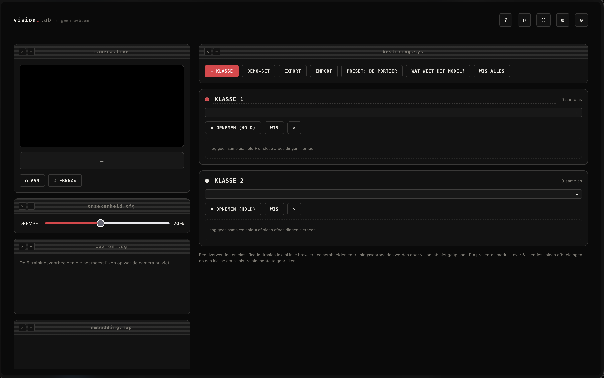

<pre>
┌────────────────────────────────────────┐
│  marise van noordenne          −  □  ✕ │
└────────────────────────────────────────┘

~ <b>ls</b>
<a href="#labs">labs/</a>            tools that show how a model decides
<a href="#provocatypes">provocatypes/</a>    prototypes built for the classroom
<a href="#elsewhere">elsewhere.cfg</a>
</pre>

Technologist by training, designer by habit, curious to a fault.

I teach at the Amsterdam University of Applied Sciences, where I lead the Dark
Tech Studio: a semester in which computing students take apart the systems
they're being trained to build. I'm also part of
[or.bit](https://www.or-bit.xyz), a small research collective.

Most of the code here started as something I needed for a class or workshop.

<h3 id="labs">labs/</h3>

<pre>
vision.lab   ●  live
glass.lab    ◐  in progress
drift.lab    ◐  in progress
</pre>

<b>vision.lab</b> — train a classifier, watch it decide

Train an image classifier from your webcam and see what it's basing its
answer on: which stored examples it matched, where you sit in the embedding
space, how sure it is and why that number is misleading. Has a presenter
mode and a QR code that hands your exact settings to a room full of
students. You can also export a model you've trained badly on purpose and
let them work out what's wrong with it.

Runs entirely in your browser. Nothing is uploaded.

<a href="https://vannoordenne.github.io/vision-lab/">Open vision.lab</a> · <a href="https://github.com/vannoordenne/vision-lab">source</a>

<b>glass.lab</b> — how a model picks the next word

Token by token, with the alternatives it passed over. In progress.

<b>drift.lab</b> — same question, different answers

The same prompt across models and across runs, and how far the answers land
from each other. In progress.

<h3 id="provocatypes">provocatypes/</h3>

Prototypes I built for Dark Tech Studio. They work, but none of them are
products.

<pre>
<a href="https://github.com/vannoordenne/cas-app">cas-app</a>           a student assessment platform, taken to its logical end
<a href="https://github.com/vannoordenne/vanta-app">vanta-app</a>         what a social platform learns while you scroll
<a href="https://github.com/vannoordenne/ucu-game-web">ucu-game-web</a>      Use Case: Unknown, a game about consequences
<a href="https://github.com/vannoordenne/speculation-game">speculation-game</a>  a workshop tool for speculating on emerging tech
</pre>

<h3 id="elsewhere">elsewhere.cfg</h3>

<pre>
collective   <a href="https://www.or-bit.xyz">or-bit.xyz</a>
method       <a href="https://darktechmethod.com">darktechmethod.com</a>
portfolio    <a href="https://www.marisevannoordenne.nl">marisevannoordenne.nl</a>
linkedin     <a href="https://www.linkedin.com/in/marisevannoordenne/">in/marisevannoordenne</a>
status       available for workshops, lectures and design
             work from September 2026
</pre>
